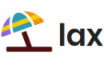

 
 

 
 ---

### The better way to chat and reLAX

___

Welcome to Lax! Lax is a single page application maded with Ruby on Rails, PostgreSQL, and React-Redux. It is a clone of the website [Slack](https://slack.com/), a popular application used to communicate within companies. With Lax, however, we prioritize relaxation, communicating with friends, and having fun.

[ splash image here]

---

### Lax uses the following technologies:
  * Backend - Ruby on Rails
  * Database - PostgreSQL
  * Frontend - JavaScript | React | Redux
  * Design - HTML5/SCSS
___

## Features
* Create an account, with passwords protected with BCrypt hashing
  * Or use a Demo Account we've already set up to skip this step completely! You'll still get full use of the app.

  [gif of errors]
* Channels and Chat:
    * View channels you've joined and communicate with other people - live! No need to refresh the page.
       * You can edit and delete your messages, and changes will show up live for other users as well!
       * [ chat gif]
    * Search channels by name, with indication of channels you haven't joined
        * You won't be able to chat in a channel until you join, so join the channel and get relaxing
        * Private channels won't show up in the search bar unless you've already joined them.
        * [search gif] 
    * Create new channels for new groups or topics
        * They'll be public by default, but you can make them private and not viewable in search
            * [ toggle private gif ]
        * After making a channel, you can add all the users as members, skip adding people completely, or search for users you want to add by name (usually full name) or email
            * [ user search gif ]
    * Delete channels - You can delete channels you've made, removing all messages forever.

---
### Have feedback or looking for a developer? Send me an <a href="mailto:megan.mcnulty07@gmail.com">email</a> and let me know!